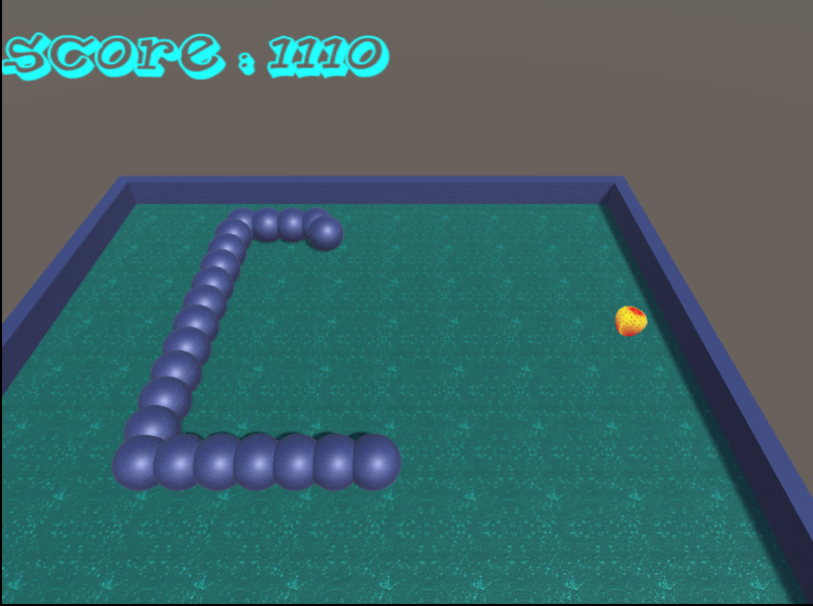
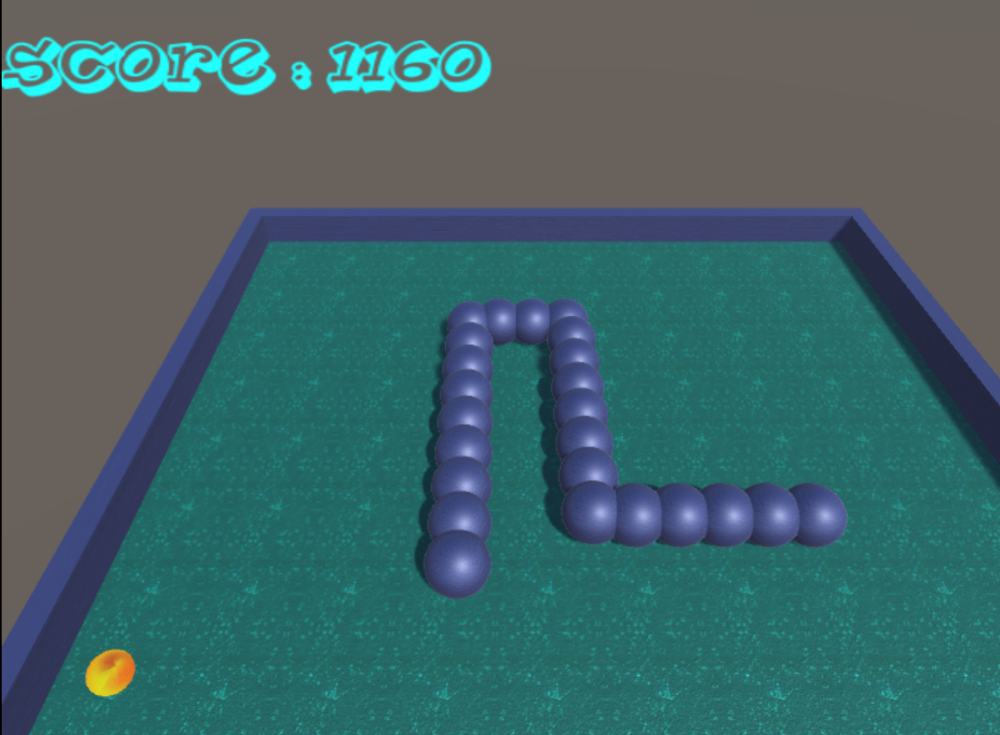
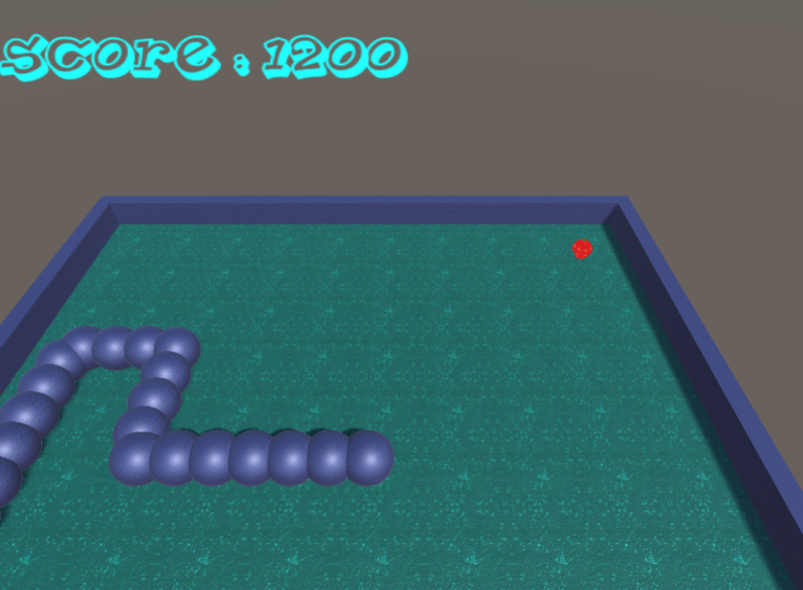
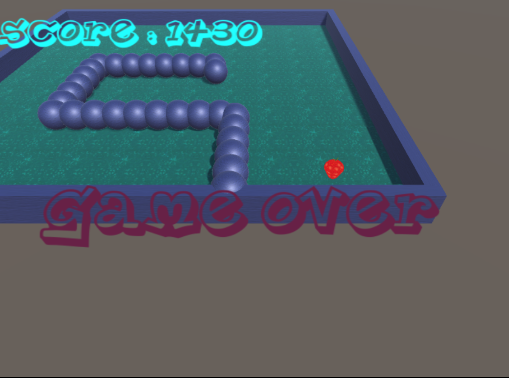
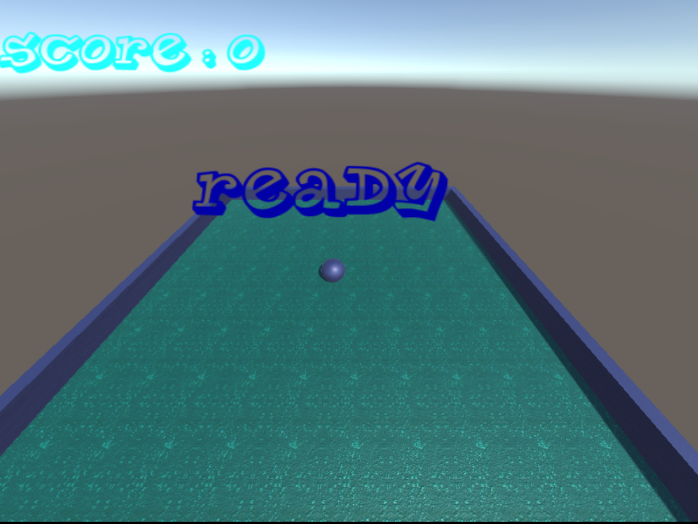
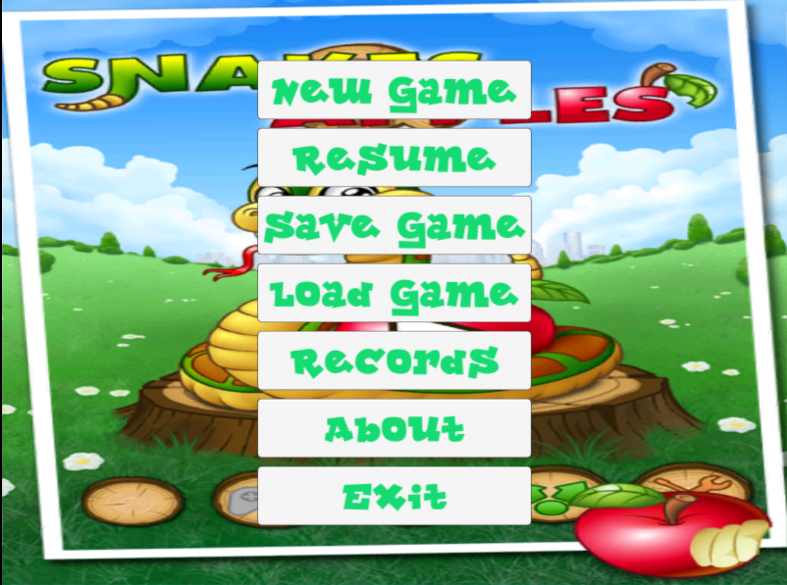
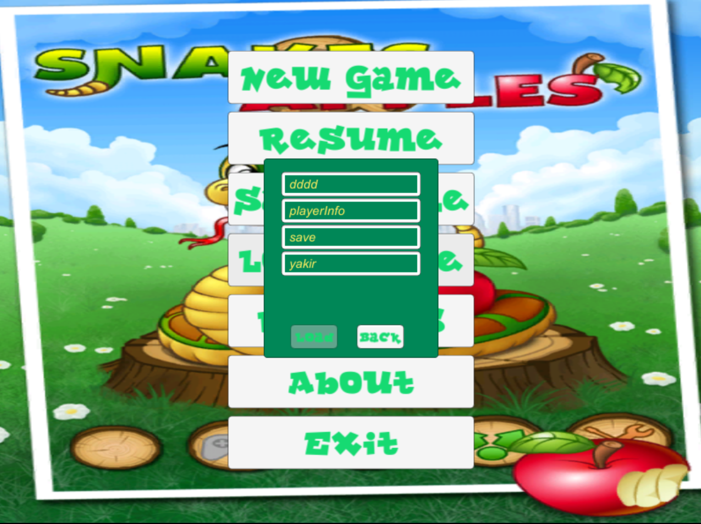

--------------------------------------------------------------------------------------------------------------
# Snake3D
--------------------------------------------------------------------------------------------------------------

Summary:
------------
Classic snake in 3D environemt.

--------------------------------------------------------------------------------------------------------------

User Interface:
---------------
Arrows in the keyboard - control snake movement

P - Pause\Resume the game\Replay when game over

Escape - Go to main menu\Return to the game

--------------------------------------------------------------------------------------------------------------

Programming Language:
---------------------
C#

--------------------------------------------------------------------------------------------------------------

3D Engine:
----------
Unity3D v5.3.4f1

--------------------------------------------------------------------------------------------------------------

Operating system:
-----------------
Windows XP/Vista/7 or above

----------------------------------------------------------------------------------------------------------------

Platform:
---------
Currently now PC only

----------------------------------------------------------------------------------------------------------------

Installation:
-------------

--------------------------------------------------------------------------------------------------------------

Running Application:
-----------------------------------------------------
Run snake3D.exe.

--------------------------------------------------------------------------------------------------------------

Screenshots:
-----------------------------------------------------

--------------------------------------------------------------------------------------------------------------
